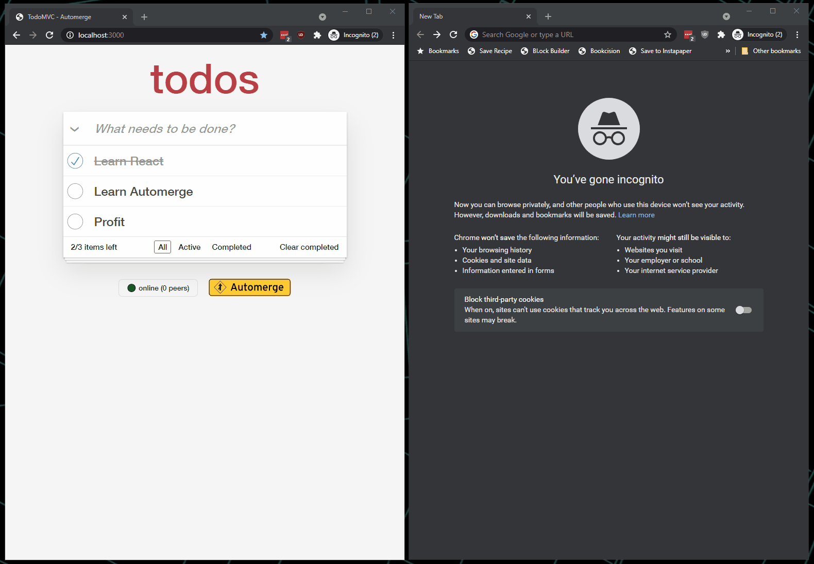
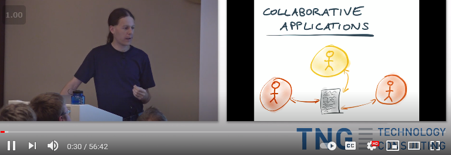

## Automerge TodoMVC demo

This is an example of how [Automerge](http://github.com/automerge/automerge) might be used to create a [local-first](http://inkandswitch.com/local-first.html) todo list, where multiple users can view and edit the list collaboratively _without_ a traditional web server.

### Peer-to-peer syncing using Automerge

Automerge is a CRDT that allows a JSON object to be modified concurrently by different users, and merged again automatically.

### Networking via a relay server

For discovery and networking, this demo uses [@localfirst/relay](https://github.com/local-first-web/relay), which is a tiny service that helps applications connect with peers on other devices.

You can deploy one or more relays at little or no cost using cloud services including
[Glitch](http://github.com/local-first-web/relay-deployable#deploying-to-glitch),
[Heroku](http://github.com/local-first-web/relay-deployable#deploying-to-heroku),
[AWS](http://github.com/local-first-web/relay-deployable#deploying-to-aws-elastic-beanstalk),
[Google](http://github.com/local-first-web/relay-deployable#deploying-to-google-cloud),
[Azure](http://github.com/local-first-web/relay-deployable#deploying-to-azure), or to a
[local server](http://github.com/local-first-web/relay-deployable#installing-and-running-locally).
